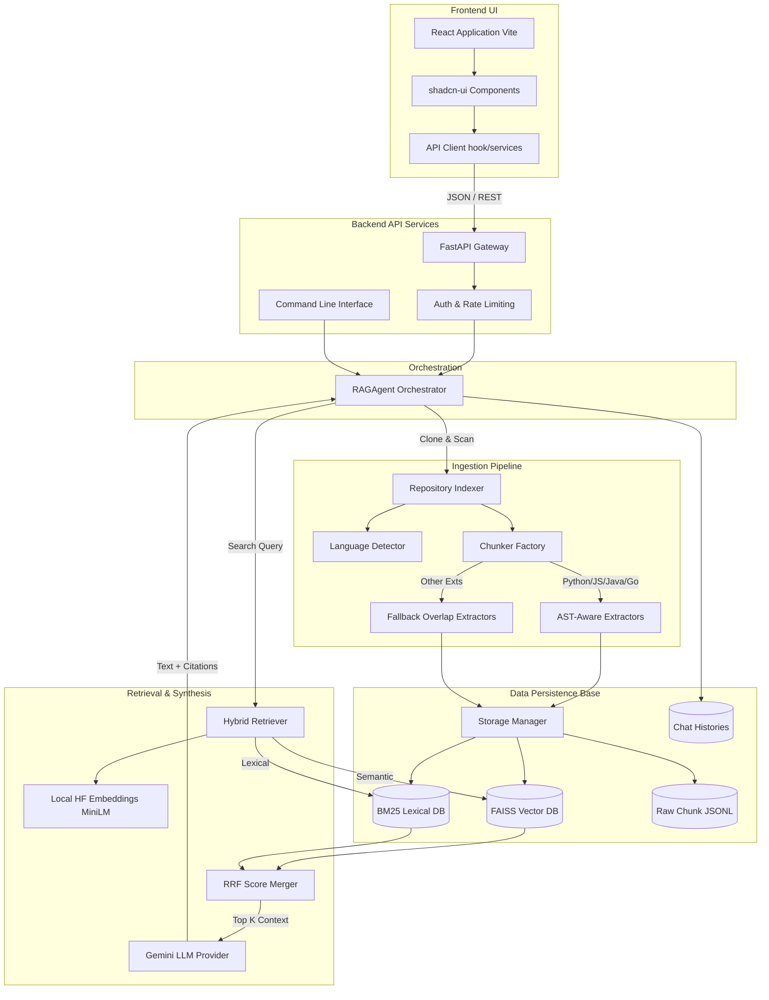

# RAG Project: Code Repository Indexing & QA System

A highly modular Retrieval-Augmented Generation (RAG) architecture designed to index entire code repositories and provide AI-driven, highly accurate developer code exploration. This repository combines an AST-aware Python backend (BM25 + FAISS + Gemini LLM) with a Vite/React user interface.

## System Architecture Data Flow

For automated visualization tools (`gitdiagram`), the following represents the core execution path and architectural domains.



## Detailed Repository Map (Component Level)

Below is the deep-dive module functionality mapping meant to perfectly represent the repository structure.

```text
.
├── backend/                       # Python Backend (Core Architecture)
│   ├── fastapi_app.py             # REST API server containing endpoints (/api/chat). Middleware for X-API-Key and throttling.
│   ├── cli.py                     # Argparse-based terminal client allowing direct local 'ask', 'index', 'chat' commands.
│   ├── rag_agent.py               # Heart of the system; `RAGAgent` coordinates ingestion, retrieval, LLM mapping, and history.
│   ├── indexer.py                 # `RepositoryIndexer`. Clones repositories, scrapes files, filters binary data.
│   ├── retriever.py               # `HybridRetriever`. Orchestrates Reciprocal Rank Fusion (RRF) between FAISS and BM25. Creates embeddings.
│   ├── llm_client.py              # `GeminiLLMWrapper`. Marshals top K retrieved code chunks into a structured prompt for Google GenAI.
│   ├── storage.py                 # `ChunkStore`. Maps vectors to disk. Reads/writes to `indexes/index_<hash>` (faiss indexing, caching).
│   ├── chat_history.py            # `ChatHistoryManager`. Stateful persistence per-repository for multi-turn LLM reasoning.
│   ├── language_detect.py         # Inspects MIME types and extensions to route to the correct chunking parser.
│   ├── chunker/                   # Text Segmentation and Knowledge Extraction
│   │   ├── chunker_factory.py     # Dispenses exact chunker class.
│   │   ├── python_chunker.py      # Uses `ast` to map out classes, methods, and functions cleanly.
│   │   ├── javascript_chunker.py  # Regex/Syntax based TS/JS chunker.
│   │   ├── java_chunker.py        # Object-Oriented block chunker for Java.
│   │   ├── go_chunker.py          # Go-lang struct/func chunker.
│   │   └── fallback_chunker.py    # Standard character-overlap chunking for unhandled file types.
│   └── evaluation/                # Benchmarking and Quality Assurance
│       ├── run_evaluation.py      # Entrypoint for running regression evaluation sets.
│       ├── retrieval_metrics.py   # Mathematical scoring for Vector DBs: Recall@K, Mean Reciprocal Rank (MRR).
│       └── generation_metrics.py  # LLM Judge logic for assessing hallucination rates and accuracy.
├── frontend/                      # User Interface (React / Vite)
│   ├── src/
│   │   ├── App.jsx                # Router & App Shell.
│   │   ├── components/            # Visual building blocks (ChatInput.jsx, ChatMessage.jsx, Citation.jsx).
│   │   ├── hooks/                 # Reusable business logic (useApi.js, use-toast.js).
│   │   └── services/api.js        # Networking boundary that links directly to backend/fastapi_app.py endpoints.
│   ├── package.json               # Node dependency tree (React, Tailwind, framer-motion, lucide-react).
│   └── tailwind.config.js         # Design token mapping and theme overrides.
├── indexes/                       # Stateful directory containing chunk blobs and `.faiss` C++ binaries.
└── histories/                     # Stateful directory storing JSON chat sessions.
```

## Setup & Quickstart

### Backend Runtime
```bash
cd backend
pip install -r requirements.txt
export GOOGLE_API_KEY="your-gemini-key"

# CLI Use:
python cli.py index https://github.com/user/project
python cli.py chat -r https://github.com/user/project

# API Server Use:
uvicorn fastapi_app:app --host 0.0.0.0 --port 5000
```

### Frontend Runtime
```bash
cd frontend
npm install
npm run dev
```
(Connects to localhost:5000 by default via `services/api.js`).

## Environment Variables
*   `GOOGLE_API_KEY` - Gemini API key.
*   `RAG_API_KEY` - Secures FastAPI backend from unauthorized frontend requests.
*   `RATE_LIMIT_REQUESTS` - Memory-based RPM throttling.
*   `ALLOWED_DOMAINS` - Validation boundary for Git ingestion (e.g. github.com, gitlab.com).
